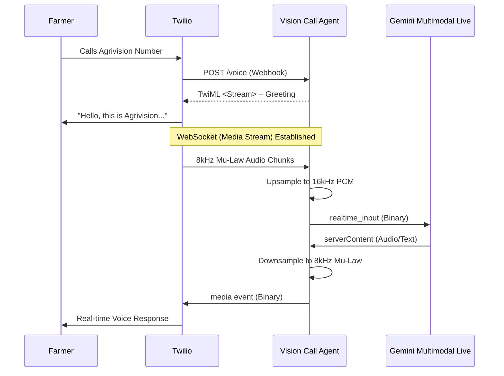

# Agrivision Call Agent

A standalone real-time AI voice assistant for agricultural support. This agent uses Twilio Media Streams to bridge phone calls directly to the Gemini Multimodal Live API for a low-latency, natural conversational experience.

## Architecture



## Features

- **Real-time Duplex Streaming**: No push-to-talk required; the AI listens and speaks simultaneously.
- **Interruption Handling**: The AI stops speaking immediately if the user starts talking over it.
- **Low Latency**: Optimized for fast, human-like interaction using Gemini 2.0 Flash.
- **Agricultural Specialized**: Pre-configured with system instructions to assist farmers with crop and disease management.

## Deployment on Railway

1. **Push to GitHub**: Push this repository to your GitHub account.
2. **Create New Project**: In [Railway.app](https://railway.app), create a new project from your GitHub repo.
3. **Environment Variables**: Add the following variable in the Railway dashboard:
   - `GEMINI_API_KEY`: Your Google AI Studio API Key.
4. **Twilio Configuration**:
   - Set your Twilio Phone Number's "A Call Comes In" webhook to: `https://your-project-url.up.railway.app/voice`

## Tech Stack

- **Node.js**: Runtime environment.
- **Express**: Web server for Twilio webhooks.
- **ws**: WebSocket implementation for Twilio Media Streams and Gemini communication.
- **Twilio SDK**: For TwiML generation.
- **Gemini Multimodal Live API**: For real-time voice intelligence.

## Local Development

1. Install dependencies:
   ```bash
   npm install
   ```
2. Create a `.env` file:
   ```env
   GEMINI_API_KEY=your_api_key_here
   PORT=5000
   ```
3. Run the server:
   ```bash
   npm start
   ```
4. Expose the port using Ngrok:
   ```bash
   ngrok http 5000
   ```
